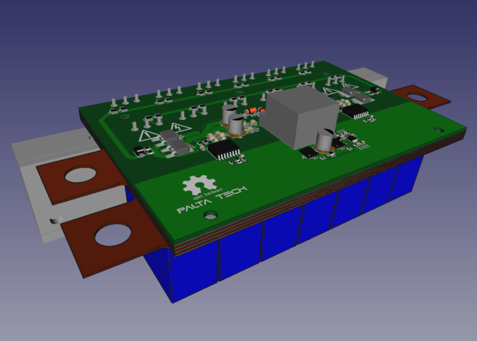

# TO247 Inverter power stage
This is the hardware repository of a 3 phase inverter, UNTESTED but designed with the following specs in mind:

* 70kw nominal, 200kw peak
* TO247 IGBT to allow for easy silicon upgrades and power capabilities. Its also cheaper.
* Watercooled
* Embedded security features (desaturation, soft turn off, reinforced isolation)

Will need some cnc milling, components, a pcb, and some spot welding

Made open source with open source tools (kicad, freecad)

## Bill of materials
BOM, pcb gerbers, and custom parts can be found in [fabrication files](https://bitbucket.org/paltatech/half-bridge) directory

